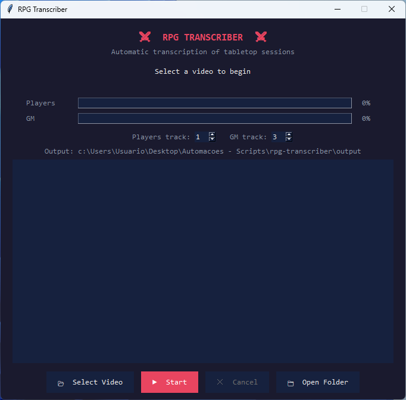
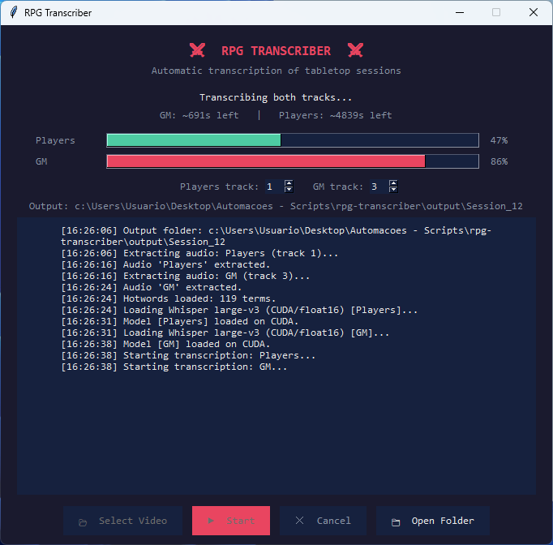
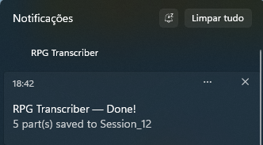

# RPG Transcriber

Turns a multi-track recording of a tabletop RPG session into a readable, speaker-attributed transcript — fully offline, no API keys, no audio ever leaves your machine.

## The problem

A four-hour game session is unsearchable. Recording it is easy; finding the moment someone made that deal with the NPC three weeks ago is not. Off-the-shelf transcription makes it worse: it produces one undifferentiated wall of text, and it butchers every invented name in the campaign.

This tool solves both. Because recordings made with OBS keep remote players and the local microphone on **separate audio tracks**, it transcribes each track independently and then interleaves them chronologically — so every line is attributed to its source without any speaker-diarisation guesswork. A per-campaign hotword list biases the model toward names it has never seen.

## Features

- **Track-based speaker attribution** — extracts two audio tracks from the source video and tags every line `[Players]` or `[GM]`, with the track indices configurable in the UI.
- **Chronological merge** — the two transcripts are interleaved by absolute session timestamp, so the conversation reads in the order it actually happened.
- **Campaign vocabulary biasing** — a plain-text hotword list teaches Whisper the proper nouns, place names and house jargon specific to your campaign.
- **Automatic segmentation** — output is split into one text file per 20 minutes of session time, keeping files small enough to paste into a summariser or search by hand.
- **Parallel transcription** — both tracks run concurrently on separate model instances, with an independent progress bar and time estimate for each.
- **GPU with automatic CPU fallback** — runs on CUDA in float16 when available, and drops to CPU int8 automatically when it is not.
- **Resumable extraction** — already-extracted WAV files are reused, so a cancelled or crashed run does not repeat the FFmpeg step.
- **Fault-tolerant chunking** — a chunk that fails to decode is logged and skipped instead of aborting a four-hour job.
- **Cooperative cancellation** — the Cancel button stops the run cleanly at the next chunk boundary.
- **Desktop GUI with live log** — Tkinter interface with progress bars, a timestamped activity log written to disk alongside the transcripts, and a Windows toast notification on completion.

## Tech stack

| Component | Purpose |
|---|---|
| **Python 3.8+** | Application language |
| **faster-whisper** (CTranslate2) | Whisper `large-v3` inference, 4–5× faster than the reference implementation |
| **FFmpeg** | Demuxing and resampling individual audio tracks to 16 kHz mono |
| **NumPy** | In-memory audio buffer slicing |
| **Tkinter** | Desktop GUI (standard library — no extra runtime) |
| **threading** | Non-blocking UI and concurrent per-track transcription |

## Screenshots

| Idle | Transcribing | Done |
|---|---|---|
|  |  |  |

## Requirements

- Python 3.8 or newer
- **FFmpeg** on your `PATH` ([download](https://ffmpeg.org/download.html))
- A source recording with the players and the game master on **separate audio tracks** (e.g. an OBS multi-track capture)
- Optional: an NVIDIA GPU with CUDA for a large speed-up

**VRAM note:** the two tracks are transcribed in parallel on two separate `large-v3` instances, which loads the weights twice — budget roughly 6 GB of VRAM. On a smaller GPU the second model falls back to CPU and the run becomes much slower; reduce `WHISPER_MODEL` in `main.py` to `medium` or `small` if that happens.

## Installation

```bash
git clone <repository-url>
cd rpg-transcriber
python -m venv venv
venv\Scripts\activate        # Windows;  source venv/bin/activate on macOS/Linux
pip install -r requirements.txt
```

Verify FFmpeg is reachable:

```bash
ffmpeg -version
```

The Whisper weights (~3 GB for `large-v3`) are downloaded automatically on first run and cached by `huggingface-hub`.

## Usage

Set up your campaign vocabulary (optional but strongly recommended):

```bash
cp hotwords.example.txt hotwords.txt
```

Edit `hotwords.txt` with your own character names, locations and lore terms. This file is git-ignored, so your campaign data stays local.

Then launch the app:

```bash
python main.py
```

1. Click **Select Video** and pick the session recording (`.mkv`, `.mp4`, `.avi`, `.mov`).
2. Confirm the **Players track** and **GM track** indices match your recording's layout. Inspect them with `ffprobe -i your-recording.mkv` if unsure — the defaults are track 1 and track 3.
3. Click **Start**. Audio extraction runs first, then both tracks transcribe in parallel.
4. Click **Open Folder** when it finishes.

The output folder is named after the last number found in the video's filename, so `campaign session 07.mkv` produces `Session_07`.

## Output structure

```
output/
└── Session_07/
    ├── players.wav                  # extracted audio, reused on re-runs
    ├── gm.wav
    ├── session_07_part_01.txt       # first 20 minutes
    ├── session_07_part_02.txt
    └── transcription.log            # timestamped run log
```

Each transcript file looks like this:

```
[Players] we should ask the innkeeper about the sealed door
[GM] he goes quiet for a moment, then says the last people who asked never came back
[Players] roll for insight?
```

## Configuration

Tunable constants live at the top of `main.py`:

| Constant | Default | Effect |
|---|---|---|
| `WHISPER_MODEL` | `large-v3` | Model size — lower it to `medium` or `small` for less VRAM and more speed |
| `CHUNK_SECONDS` | `15` | Audio slice length sent to the model |
| `BLOCK_MINUTES` | `20` | Session minutes per output file |
| `DEFAULT_PLAYERS_TRACK` | `1` | Initial value of the Players track spinner |
| `DEFAULT_GM_TRACK` | `3` | Initial value of the GM track spinner |

Transcription language is currently fixed to Portuguese (`language="pt"` in `RPGTranscriberApp.transcribe`). Change that argument to transcribe another language, or drop it to let Whisper auto-detect.

## Known limitations

- Exactly two audio tracks are supported — one for the players, one for the game master. Per-player attribution would require one track per player.
- Audio is sliced on fixed 15-second boundaries with no overlap, so a word spoken exactly across a boundary can be clipped.
- Cancellation is cooperative and takes effect at the next chunk boundary, not instantly.

## License

MIT
